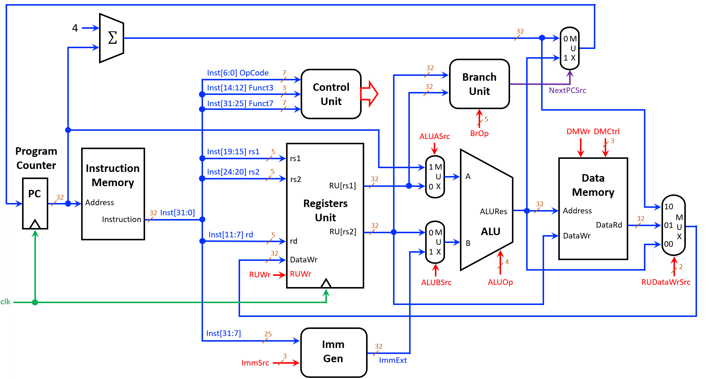

# RISC-V Single Cycle Processor

## A complete 32-bit RISC-V processor implementation in SystemVerilog for FPGA deployment

This project is a **hardware description** built to demonstrate how to **implement a fully functional RISC-V RV32I processor using a single-cycle architecture**.  
It serves as an **educational reference and FPGA-ready design** and showcases how to:

- 🚀 Execute RV32I base integer instructions in a single clock cycle
- ⚡ Interface with 7-segment displays via memory-mapped I/O
- 🔧 Implement modular CPU components (ALU, Control Unit, Registers, etc.)
- 🎨 Support branch and jump instructions with dedicated Branch Unit
- 📦 Load custom programs from hex files into instruction memory
- 🌍 Deploy to Intel/Altera FPGAs with Quartus Prime

## Features

| Feature                      | Description                                                                 |
| ---------------------------- | --------------------------------------------------------------------------- |
| **RV32I Base Instructions**  | Supports R-type, I-type, S-type, B-type, U-type, and J-type instructions    |
| **Single-Cycle Design**      | Each instruction completes in exactly one clock cycle                       |
| **Memory-Mapped I/O**        | 7-segment display imlemented via memory-mapped address                      |
| **Modular Architecture**     | Each component (ALU, Control, Registers) is a separate testable module      |
| **FPGA Ready**               | Includes wrapper module for direct synthesis to Intel/Altera FPGAs          |
| **Simulation Support**       | Testbenches included for all modules with VCD waveform generation           |

## Project Structure

```
risc-v_single_cycle_processor/
├── ALU/                        # Arithmetic Logic Unit
│   ├── ALU.sv                  # 32-bit ALU with 10 operations
│   └── ALU_tb.sv               # ALU testbench
│
├── BranchUnit/                 # Branch condition evaluation
│   ├── BranchUnit.sv           # Evaluates BEQ, BNE, BLT, BGE, etc.
│   └── BranchUnit_tb.sv        # Branch Unit testbench
│
├── ControlUnit/                # Instruction decoder
│   ├── ControlUnit.sv          # Generates control signals from OpCode
│   └── ControlUnit_tb.sv       # Control Unit testbench
│
├── DataMemory/                 # Data RAM (8 KiB)
│   ├── DataMemory.sv           # Supports LB, LH, LW, SB, SH, SW
│   └── DataMemory_tb.sv        # Data Memory testbench
│
├── ImmGen/                     # Immediate value generator
│   ├── ImmGen.sv               # Sign-extends immediates for all formats
│   └── ImmGen_tb.sv            # Immediate Generator testbench
│
├── InstructionMemory/          # Program ROM
│   ├── InstructionMemory.sv    # Loads programs from .hex files
│   └── InstructionMemory_tb.sv # Instruction Memory testbench
│
├── ProgramCounter/             # PC register
│   ├── ProgramCounter.sv       # 32-bit program counter with reset
│   └── ProgramCounter_tb.sv    # Program Counter testbench
│
├── RegistersUnit/              # Register file (x0-x31)
│   ├── RegistersUnit.sv        # 32 registers, dual read, single write
│   └── RegistersUnit_tb.sv     # Registers Unit testbench
│
├── muxs/                       # Multiplexers
│   ├── ALUA.sv                 # ALU input A selector (PC or rs1)
│   ├── ALUB.sv                 # ALU input B selector (rs2 or Imm)
│   ├── NextPC.sv               # Next PC selector (PC+4 or ALURes)
│   └── RUDataWr.sv             # Register write data selector
│
├── I_O_Implementation/         # FPGA I/O modules
│   ├── RiscV_SingleCycle_FPGA.sv    # ⭐ Top module for FPGA synthesis
│   ├── SevenSegmentDisplay/         # 7-segment display drivers
│   │   ├── SevenSegmentDisplay.sv   # Hex to 7-segment decoder
│   │   └── DisplayController.sv     # 8-display controller for 32-bit values
│   └── programs/                    # FPGA-specific programs
│
├── test_programs/              # Assembly programs in binary format
│
├── RiscV_SingleCycle.sv        # Main processor module (simulation)
├── RiscV_SingleCycle_tb.sv     # Top-level testbench
├── run_test.sh                 # Script to run simulation
└── test_display.sh             # Script to test 7-segment modules
```

## Supported Instructions

| Type   | Instructions                                    |
| ------ | ----------------------------------------------- |
| R-type | `ADD`, `SUB`, `AND`, `OR`, `XOR`, `SLL`, `SRL`, `SRA`, `SLT`, `SLTU` |
| I-type | `ADDI`, `ANDI`, `ORI`, `XORI`, `SLTI`, `SLTIU`, `SLLI`, `SRLI`, `SRAI` |
| Load   | `LB`, `LH`, `LW`, `LBU`, `LHU`                  |
| Store  | `SB`, `SH`, `SW`                                |
| Branch | `BEQ`, `BNE`, `BLT`, `BGE`, `BLTU`, `BGEU`      |
| Jump   | `JAL`, `JALR`                                   |
| Upper  | `LUI`, `AUIPC`                                  |

## How to Install & Run

### Prerequisites

- **Icarus Verilog** (iverilog) - For simulation
- **GTKWave** (optional) - For waveform visualization
- **Intel Quartus Prime** - For FPGA synthesis (optional)

### Installation Steps

1. **Clone this repository**

   ```bash
   git clone https://github.com/MateoMor/risc-v_single_cycle_processor.git
   cd risc-v_single_cycle_processor
   ```

2. **Run the processor simulation**

   ```bash
   chmod +x run_test.sh
   ./run_test.sh
   ```

3. **Test the 7-segment display modules**

   ```bash
   chmod +x test_display.sh
   ./test_display.sh
   ```

4. **View waveforms (optional)**
   ```bash
   gtkwave riscv_tb.vcd
   ```

### FPGA Deployment

1. Open **Intel Quartus Prime**
2. Create a new project and add all `.sv` files
3. Set `I_O_Implementation/RiscV_SingleCycle_FPGA.sv` as the **top-level entity**
4. Assign pins according to your FPGA board (DE2-115, DE10-Lite, etc.)
5. Compile and program the FPGA

## Tech Stack

| Category            | Technology                          |
| ------------------- | ----------------------------------- |
| **HDL**             | SystemVerilog (IEEE 1800-2012)      |
| **Simulator**       | Icarus Verilog                      |
| **Waveform Viewer** | GTKWave                             |
| **FPGA Toolchain**  | Intel Quartus Prime                 |
| **Target FPGAs**    | Intel Cyclone IV/V, MAX 10          |

## Memory Map

| Address Range             | Description                    |
| ------------------------- | ------------------------------ |
| `0x00000000 - 0x00001FFF` | Data Memory (8 KiB)            |
| `0xFFFFFFFC`              | 7-Segment Display (write-only) |


## How to Customize This Project

This project is designed to be reusable.  
You can fork or clone it and adapt it to your own needs by:

- 🔧 **Add new instructions**: Extend `ControlUnit.sv` and `ALU.sv` for M/F extensions
- 🎨 **Change I/O peripherals**: Modify `RiscV_SingleCycle_FPGA.sv` for LEDs, switches, UART
- 🌍 **Port to other FPGAs**: Adjust pin assignments for Xilinx, Lattice, etc.
- ⚙️ **Increase memory**: Modify `DataMemory.sv` and `InstructionMemory.sv` parameters

It works well as a starter boilerplate for **computer architecture courses, FPGA learning, and RISC-V experimentation**.

## Architecture Diagram



*Source: "Arquitectura de Computadoras con RISC-V" by Jaramillo Villegas et al., Universidad Tecnológica de Pereira*


## Acknowledgments

Based on "Arquitectura de Computadoras con RISC-V" by Jaramillo Villegas et al., Universidad Tecnológica de Pereira.

For further reading, see the official publication: [Arquitectura de Computadoras con RISC-V](https://repositorio.utp.edu.co/entities/publication/bef1bbae-3d4c-44ec-8cd1-f146f3a130ff) by Jaramillo Villegas et al., available through the Universidad Tecnológica de Pereira repository.

## License

This project is licensed under the **MIT License** - see the [LICENSE](LICENSE) file for details.

© 2025 Mateo Morales
